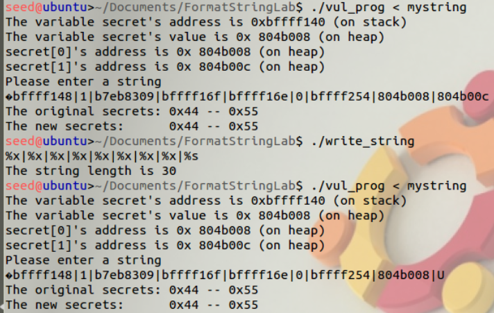

# Homework 3

## Allen Clark

### CS 575 - Spring 2019

### 2019, April 4th

----

## String Formatting

## Task 1: Exploiting the Vulnerability

### Crash


When using print string format (%s) it will try to read the address and print the string representation of that address. That means that if it tries to read an invalid address and then print it as a string it will crash the program. Therefore if you use printf(…) function and you try to print a bunch of %s it usually will crash the program.

### Show `secret[1]`

While we were not required to print the value that is stored at secret[0] it found it helpful to understanding what was need to uncover the value that was hiding at the second index of the array.


The above shows a dump of the address using the `%x` string format flag. Through this list we can see clearly (although it took me some time to realize) the address **804b008**. This address corresponds to the address that is listed by the program for secret[0]. Listing out the correct number of `%x`, in this case 7, to match the offset of the desired memory address and then print out the string value using the `%s` format flag get's the value for *0x44*.

Slightly different, but the provided address for secret[1] can be used to print out its value. This can be done by filling up the integer variable that the user is asked to input with the integer representation of the address. This will get us the desired offset. Once we have this we can use the same method that was used to get secret[0] to get the value of the second index, which is U or **0x55**. This can be seen below.
![Task 1 Secret[0]](printf_task1_showD.png)

### Modify value of `secret[1]`

The `%n` format string will overwrite the values that are stored at the location of secret[1] with the number of characters that were written before it. This can be seen below.

Nothing written before the `%n`.


Two characters written before `%n`: H I.


## Task 2: Memory randomization

> Note: I turned off memory randomization for the previous step as to make the behavior of the program more consistent.

Commenting out `scanf(...)` in vul_prog.c :

``` C
int main(int argc, char *argv[])
{
    char user_input[100];
    int *secret;
    int int_input;
    int b, c, d; /* other variables, not used here.*/

    // we need to take up space so that we have a nice offset
    // to easily find the desired address
    // pretty much the same role as we did in the first part of the lab
    int a = 134524940;

    /* The secret value is stored on the heap */
    secret = (int *) malloc(2*sizeof(int));
    /* getting the secret */
    secret[0] = SECRET1; secret[1] = SECRET2;

    printf("The variable secret's address is 0x%8x (on stack)\n", (unsigned int)&secret);
    printf("The variable secret's value is 0x%8x (on heap)\n", (unsigned int)secret);
    printf("secret[0]'s address is 0x%8x (on heap)\n", (unsigned int)&secret[0]);
    printf("secret[1]'s address is 0x%8x (on heap)\n", (unsigned int)&secret[1]);

//    printf("Please enter a decimal integer\n");
//    scanf("%d", &int_input);  /* getting an input from user */
    printf("Please enter a string\n");
    scanf("%s", user_input); /* getting a string from user */

    /* Vulnerable place */
    printf(user_input);
    printf("\n");

    /* Verify whether your attack is successful */
    printf("The original secrets: 0x%x -- 0x%x\n", SECRET1, SECRET2);
    printf("The new secrets:      0x%x -- 0x%x\n", secret[0], secret[1]);
    return 0;
}

```

Desired Address in write_string.c :

```C
int main()
{
    char buf[1000];
    int fp, size;
    unsigned int *address;

    /* Putting any number you like at the beginning of the format string */
    address = (unsigned int *) buf;
    *address = 0x804b00c; // The address found from running vul_prog
```

As can be seen below, the string that was specified in the "mystring" text file was passed into the `vul_prog` and secret[1] value is shown. This is done by using the `int a` to allocate some empty space, much like what we did in the first part of the lab.

We set its value to be the decimal representation of the desired address' hex. This created the desired offset and thereby letting us find and access the data at secret[1].

No user integer input:


## Sources

https://www.youtube.com/watch?v=df5P5DiBLng&feature=youtu.be
https://stackoverflow.com/questions/16067427/accessing-2nd-element-of-an-array-in-a-format-string-vulnerability-attack
