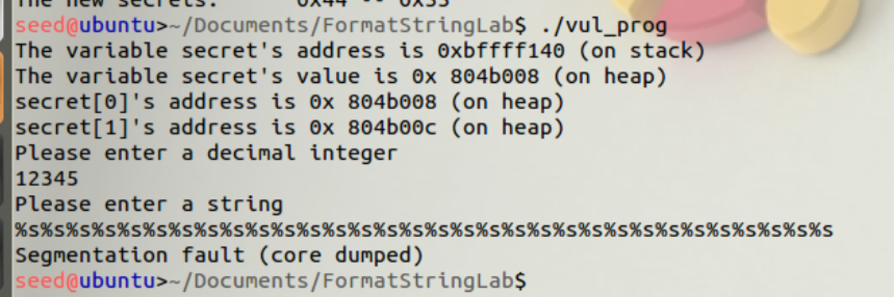
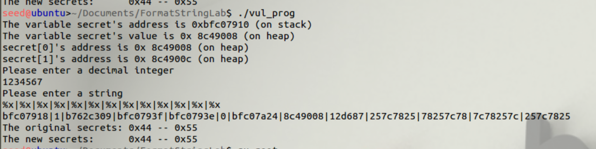
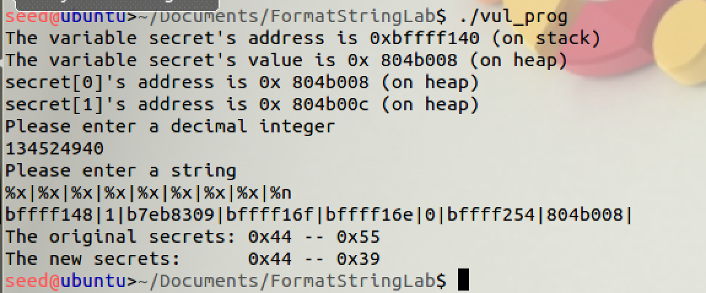
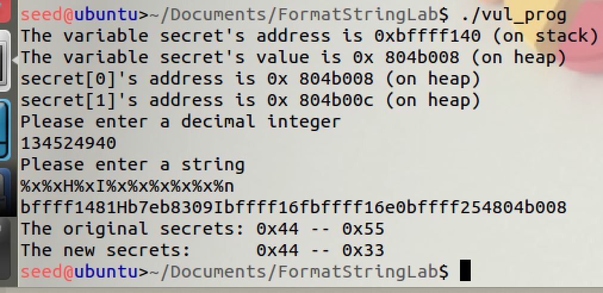

# Homework 3

## Allen Clark

### CS 575 - Spring 2019

### 2019, April 4th

----

## String Formatting

## Task 1: Exploiting the Vulnerability

### Crash

When using print string format (%s) it will try to read the address and print the string representation of that address. That means that if it tries to read an invalid address and then print it as a string it will crash the program. Therefore if you use printf(…) function and you try to print a bunch of %s it usually will crash the program.

### Show `secret[1]`

While we were not required to print the value that is stored at secret[0] it found it helpful to understanding what was need to uncover the value that was hiding at the second index of the array.

The above shows a dump of the address using the `%x` string format flag. Through this list we can see clearly (although it took me some time to realize) the address **804b008**. This address corresponds to the address that is listed by the program for secret[0]. Listing out the correct number of `%x`, in this case 7, to match the offset of the desired memory address and then print out the string value using the `%s` format flag get's the value for *0x44*.

Slightly different, but the provided address for secret[1] can be used to print out its value. This can be done by filling up the integer variable that the user is asked to input with the integer representation of the address. This will get us the desired offset. Once we have this we can use the same method that was used to get secret[0] to get the value of the second index, which is U or **0x55**. This can be seen below.
![Task 1 Secret[0]](printf_task1_showD.png)

### Modify value of `secret[1]`

The `%n` format string will overwrite the values that are stored at the location of secret[1]. These values are determined by what has already been written. This can be seen below.

Nothing written before the `%n`.

Two characters written before `%n`: H I.

## Task 2: Memory randomization

> Note: I turned off memory randomization for the previous step as to make the behavior of the program more consistent. For the following steps it will remain off and for the final step I will turn if off and repeat the "show secret[1]" step.